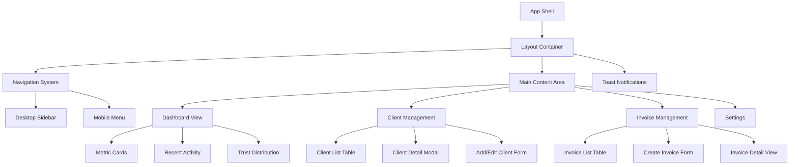

# Design Document: VyapaarOS Frontend

## Overview

VyapaarOS frontend is a responsive business management interface that provides SMB owners with an intuitive, seamless experience for managing clients, invoices, and business metrics. The design follows a mobile-first approach with a card-based layout that emphasizes clarity, accessibility, and efficient task completion.

The interface leverages the comprehensive VyapaarOS design system with its trust-based color palette to create visual hierarchy and immediate understanding of business health through color-coded segments and status indicators.

## Architecture

### Component Architecture



### Responsive Breakpoints

- **Mobile**: 320px - 767px (Primary focus)
- **Tablet**: 768px - 1023px
- **Desktop**: 1024px - 1439px
- **Large Desktop**: 1440px+

### Navigation Strategy

**Desktop (≥1024px)**: Fixed left sidebar with full navigation labels
**Tablet (768px-1023px)**: Collapsible sidebar with icons and labels
**Mobile (<768px)**: Bottom navigation bar with primary actions + hamburger menu for secondary

## Components and Interfaces

### 1. Layout System

#### App Shell
```typescript
interface AppShell {
  navigation: NavigationComponent;
  mainContent: ReactNode;
  notifications: ToastContainer;
  loading: LoadingOverlay;
}
```

**Design Specifications:**
- Background: Page background (#F9FAFB)
- Navigation: Trust Blue (#0061FF) background
- Content area: White (#FFFFFF) with subtle shadows
- Responsive grid system with 12-column layout

#### Navigation Component
```typescript
interface NavigationProps {
  currentRoute: string;
  userRole: 'owner' | 'admin' | 'user';
  notifications: number;
}

interface NavigationItem {
  id: string;
  label: string;
  icon: LucideIcon;
  route: string;
  badge?: number;
}
```

**Desktop Sidebar (≥1024px):**
- Width: 280px fixed
- Background: Trust Blue (#0061FF)
- Text: White (#FFFFFF)
- Active state: Darker Blue (#0040CC) background
- Hover: 0.8 opacity on white text

**Mobile Bottom Navigation (<768px):**
- Height: 60px
- Background: White (#FFFFFF)
- Border-top: 1px solid #E5E7EB
- Icons: Trust Blue (#0061FF)
- Active: Trust Blue background with white icon

### 2. Dashboard Components

#### Metric Cards
```typescript
interface MetricCard {
  title: string;
  value: string | number;
  change?: {
    value: number;
    period: string;
    trend: 'up' | 'down' | 'neutral';
  };
  icon: LucideIcon;
  color: 'primary' | 'success' | 'warning' | 'danger';
}
```

**Card Design:**
- Background: White (#FFFFFF)
- Border: 1px solid #E5E7EB
- Border radius: 12px
- Padding: 24px
- Shadow: 0 1px 3px rgba(0,0,0,0.1)
- Hover: 0 4px 12px rgba(0,0,0,0.15)

**Trust Segment Distribution Card:**
```typescript
interface TrustSegmentCard {
  segments: {
    butterfly: { count: number; percentage: number };
    loyal: { count: number; percentage: number };
    oneTime: { count: number; percentage: number };
    risky: { count: number; percentage: number };
  };
}
```

Visual representation using horizontal bar chart with segment colors and emojis.

#### Recent Activity Feed
```typescript
interface ActivityItem {
  id: string;
  type: 'invoice_created' | 'payment_received' | 'client_added' | 'invoice_overdue';
  timestamp: Date;
  description: string;
  client?: ClientSummary;
  amount?: number;
  status: 'success' | 'warning' | 'danger' | 'info';
}
```

### 3. Client Management Components

#### Client List Table
```typescript
interface ClientListProps {
  clients: Client[];
  sortBy: 'name' | 'trustScore' | 'lastPayment' | 'totalOwed';
  sortOrder: 'asc' | 'desc';
  filters: ClientFilters;
  onClientSelect: (client: Client) => void;
}

interface Client {
  id: string;
  name: string;
  email: string;
  phone?: string;
  trustScore: number;
  segment: 'butterfly' | 'loyal' | 'oneTime' | 'risky';
  totalOwed: number;
  lastPayment?: Date;
  invoiceCount: number;
}
```

**Table Design:**
- Header: #F9FAFB background, #6B7280 text
- Rows: White background, #E5E7EB borders
- Hover: #F9FAFB background
- Trust score: Colored badge with segment emoji
- Mobile: Stacked card layout instead of table

#### Client Detail Modal
```typescript
interface ClientDetailProps {
  client: Client;
  invoices: Invoice[];
  paymentHistory: Payment[];
  onEdit: () => void;
  onClose: () => void;
}
```

**Modal Design:**
- Overlay: rgba(0,0,0,0.5)
- Container: White background, 12px border radius
- Max width: 800px on desktop, full width on mobile
- Header: Client name with trust segment badge
- Tabs: Invoice history, payment history, notes

### 4. Invoice Management Components

#### Invoice List Table
```typescript
interface InvoiceListProps {
  invoices: Invoice[];
  filters: InvoiceFilters;
  onInvoiceSelect: (invoice: Invoice) => void;
  onStatusChange: (invoiceId: string, status: InvoiceStatus) => void;
}

interface Invoice {
  id: string;
  number: string;
  client: ClientSummary;
  amount: number;
  dueDate: Date;
  status: 'paid' | 'pending' | 'overdue';
  createdDate: Date;
  paidDate?: Date;
}
```

**Status Badge Design:**
- Paid: Green background (#D1FAE5), dark green text (#047857)
- Pending: Amber background (#FEF3C7), dark amber text (#D97706)
- Overdue: Red background (#FEE2E2), dark red text (#DC2626)

#### Invoice Form
```typescript
interface InvoiceFormProps {
  mode: 'create' | 'edit';
  initialData?: Partial<Invoice>;
  clients: ClientSummary[];
  onSubmit: (invoice: InvoiceData) => void;
  onCancel: () => void;
}
```

**Form Design:**
- Two-column layout on desktop, single column on mobile
- Client selection: Searchable dropdown with trust score indicators
- Amount input: Currency formatting with validation
- Due date: Date picker with smart defaults (30 days)
- Items: Dynamic list with add/remove functionality

### 5. Form Components

#### Input Field
```typescript
interface InputFieldProps {
  label: string;
  type: 'text' | 'email' | 'tel' | 'number' | 'date';
  value: string;
  onChange: (value: string) => void;
  error?: string;
  required?: boolean;
  placeholder?: string;
}
```

**Input Styling:**
- Border: 1px solid #D1D5DB
- Focus: 2px solid Trust Blue (#0061FF)
- Error: 2px solid Risk Red (#EF4444)
- Height: 44px (touch-friendly)
- Border radius: 8px
- Padding: 12px 16px

#### Button Component
```typescript
interface ButtonProps {
  variant: 'primary' | 'secondary' | 'danger' | 'success';
  size: 'sm' | 'md' | 'lg';
  children: ReactNode;
  onClick: () => void;
  disabled?: boolean;
  loading?: boolean;
}
```

**Button Variants:**
- Primary: Trust Blue background, white text
- Secondary: Light gray background, dark text
- Danger: Risk Red background, white text
- Success: Butterfly Green background, white text

## Data Models

### Client Model
```typescript
interface Client {
  id: string;
  name: string;
  email: string;
  phone?: string;
  address?: Address;
  trustScore: number;
  segment: TrustSegment;
  createdDate: Date;
  lastPaymentDate?: Date;
  totalInvoiced: number;
  totalPaid: number;
  totalOwed: number;
  invoiceCount: number;
  notes?: string;
}

type TrustSegment = 'butterfly' | 'loyal' | 'oneTime' | 'risky';

interface Address {
  street: string;
  city: string;
  state: string;
  zipCode: string;
  country: string;
}
```

### Invoice Model
```typescript
interface Invoice {
  id: string;
  number: string;
  clientId: string;
  client: ClientSummary;
  items: InvoiceItem[];
  subtotal: number;
  tax: number;
  total: number;
  status: InvoiceStatus;
  createdDate: Date;
  dueDate: Date;
  paidDate?: Date;
  notes?: string;
}

type InvoiceStatus = 'draft' | 'sent' | 'paid' | 'overdue' | 'cancelled';

interface InvoiceItem {
  id: string;
  description: string;
  quantity: number;
  rate: number;
  amount: number;
}
```

### Dashboard Model
```typescript
interface DashboardData {
  metrics: {
    totalRevenue: number;
    pendingAmount: number;
    overdueAmount: number;
    clientCount: number;
  };
  trustDistribution: {
    butterfly: number;
    loyal: number;
    oneTime: number;
    risky: number;
  };
  recentActivity: ActivityItem[];
  upcomingDueDates: Invoice[];
}
```

Now I need to use the prework tool to analyze the acceptance criteria before writing the correctness properties:

<function_calls>
<invoke name="prework">
<parameter name="featureName">vyapaaros-frontend

## Correctness Properties

*A property is a characteristic or behavior that should hold true across all valid executions of a system—essentially, a formal statement about what the system should do. Properties serve as the bridge between human-readable specifications and machine-verifiable correctness guarantees.*

Based on the prework analysis, I've identified several redundant properties that can be consolidated:

**Property Consolidation:**
- Properties 1.2 and 2.2 both test trust segment color/emoji consistency → Combined into Property 1
- Properties 5.2 and 3.1 both test semantic status colors → Combined into Property 2  
- Properties 5.1, 5.3, and 5.5 all test design system compliance → Combined into Property 3

### Property 1: Trust Segment Visual Consistency
*For any* trust segment data (Butterfly, Loyal, One-Time, Risky), the system should always display the correct color and emoji combination: Butterfly with green (#10B981) and 🦋, Loyal with amber (#F59E0B) and ⭐, One-Time with indigo (#6366F1) and 💤, Risky with red (#EF4444) and ⚠️
**Validates: Requirements 1.2, 2.2**

### Property 2: Status Color Semantic Consistency  
*For any* status information (invoice status, operation results, notifications), the system should use semantic colors consistently: success states with green (#10B981), warning states with amber (#F59E0B), danger/error states with red (#EF4444), and neutral states with gray (#6B7280)
**Validates: Requirements 3.1, 5.2**

### Property 3: Design System Compliance
*For any* UI element, the system should use only colors, typography, and styling defined in the design system, with interactive elements providing appropriate hover and active states using the specified color variations
**Validates: Requirements 5.1, 5.3, 5.5**

### Property 4: Dashboard Data Completeness
*For any* dashboard access, the system should display all required metrics (total revenue, pending invoices, client distribution by trust segments) and the latest 5 invoices with complete information
**Validates: Requirements 1.1, 1.3**

### Property 5: Real-time UI Updates
*For any* data change (metrics update, invoice status change, client addition), the system should update the display immediately without requiring page reload while maintaining data consistency
**Validates: Requirements 1.5, 3.4**

### Property 6: Client Data Display Completeness
*For any* client in the system, when displayed in lists or detail views, all required information should be present: trust score, segment classification, recent payment history, and outstanding invoices
**Validates: Requirements 2.1, 2.3**

### Property 7: Search and Filter Functionality
*For any* search query or filter criteria, the system should update results in real-time and maintain accurate filtering across all searchable fields (client names, invoice numbers, statuses)
**Validates: Requirements 2.4, 3.5**

### Property 8: Form Validation and Feedback
*For any* form interaction, the system should provide immediate visual feedback (focus states with Trust Blue border), validate inputs in real-time, and display appropriate success (green) or error (red) messages with specific guidance
**Validates: Requirements 2.5, 6.1, 6.2, 6.3, 6.4**

### Property 9: Responsive Navigation Behavior
*For any* viewport size, the navigation system should adapt appropriately: desktop sidebar for ≥1024px, collapsible sidebar for tablets, hamburger menu for mobile, with active states highlighted in Trust Blue and touch-friendly sizing (≥44px) on mobile devices
**Validates: Requirements 4.2, 4.3, 4.4**

### Property 10: Table Display and Interaction
*For any* data table, the system should use alternating row colors (#F9FAFB), provide hover highlighting, display status badges with appropriate colors, stack columns responsively on mobile, and show helpful empty states when no data exists
**Validates: Requirements 7.1, 7.2, 7.3, 7.4, 7.5**

### Property 11: Loading and Progress States
*For any* loading operation, the system should display loading indicators that match the design system, show progress feedback for operations longer than 1 second, and use placeholder states for images/icons to prevent layout shifts
**Validates: Requirements 8.1, 8.2, 8.4**

### Property 12: Mobile Input Optimization
*For any* form displayed on mobile viewports, the system should use appropriate HTML input types (email, tel, number, date) to trigger correct mobile keyboards and improve user experience
**Validates: Requirements 6.5**

### Property 13: Invoice Status Highlighting
*For any* overdue invoice, the system should apply prominent visual highlighting using danger colors and suggest appropriate follow-up actions to draw user attention
**Validates: Requirements 3.3**

## Error Handling

### Client-Side Error Boundaries
- React Error Boundaries to catch component crashes
- Graceful degradation with user-friendly error messages
- Automatic error reporting to monitoring service
- Fallback UI components for critical sections

### Form Validation Strategy
- Real-time validation with debounced input checking
- Client-side validation for immediate feedback
- Server-side validation for security and data integrity
- Clear, actionable error messages in red (#EF4444)
- Field-level and form-level validation states

### Network Error Handling
- Retry mechanisms for failed API calls
- Offline state detection and user notification
- Cached data fallbacks when possible
- Loading states with timeout handling
- Connection status indicator

### Data Loading Errors
- Empty state designs for failed data loads
- Retry buttons with exponential backoff
- Partial data display when some requests fail
- Error toast notifications with dismiss options

## Testing Strategy

### Dual Testing Approach

The testing strategy employs both unit tests and property-based tests as complementary approaches:

**Unit Tests** focus on:
- Specific examples that demonstrate correct behavior
- Edge cases and error conditions (empty data, network failures)
- Integration points between components
- User interaction flows (form submission, navigation)
- Accessibility compliance (keyboard navigation, screen readers)

**Property-Based Tests** focus on:
- Universal properties that hold across all inputs
- Comprehensive input coverage through randomization
- Design system compliance across all components
- Data consistency and UI synchronization
- Responsive behavior across viewport ranges

### Property-Based Testing Configuration

**Testing Library**: fast-check (JavaScript/TypeScript property-based testing)
**Minimum Iterations**: 100 per property test
**Test Tagging Format**: **Feature: vyapaaros-frontend, Property {number}: {property_text}**

Each property test must:
1. Reference its corresponding design document property
2. Generate diverse, realistic test data
3. Verify the universal property holds across all generated inputs
4. Provide clear failure messages with counterexamples

### Unit Testing Focus Areas

**Component Testing**:
- Render testing with various props combinations
- Event handling and state management
- Conditional rendering based on data states
- Error boundary behavior

**Integration Testing**:
- Form submission workflows
- Navigation between views
- Data synchronization between components
- API integration with mock responses

**Accessibility Testing**:
- Keyboard navigation completeness
- Screen reader compatibility
- Color contrast verification
- Focus management

### Performance Testing

**Core Web Vitals Monitoring**:
- Largest Contentful Paint (LCP) < 2.5s
- First Input Delay (FID) < 100ms
- Cumulative Layout Shift (CLS) < 0.1

**Load Testing Scenarios**:
- Dashboard with 1000+ clients
- Invoice tables with 5000+ records
- Real-time updates with high frequency
- Mobile performance on slower devices

### Visual Regression Testing

**Screenshot Testing**:
- Component library documentation
- Key user flows across breakpoints
- Error states and edge cases
- Dark mode compatibility (future)

**Design System Compliance**:
- Color usage verification
- Typography consistency
- Spacing and layout adherence
- Interactive state appearances